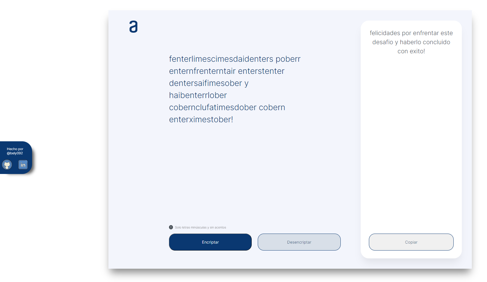

# Challenge_Encrypter-ONE
Desafío Programación Oracle ONE - Encriptador


<hr>


<p>
La Pagina solicita al usuario ingresar una cadena de texto o mensaje 
para encriptar o desencriptarlo segun el siguiente patrón:

</p>

```
 | a |   ai  |
 | e | enter |
 | i |  imes |
 | o |  ober |
 | u |  ufat |

```

`<link>` : <https://bely092.github.io/Challenge_Encrypter-ONE/>

## Vista Principal

<br>

## Vista Trabajo



